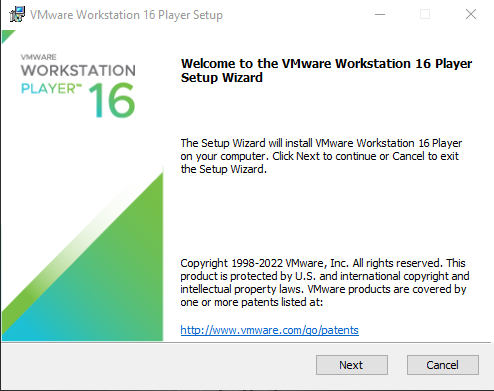
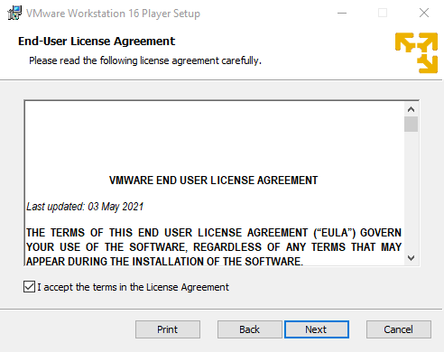
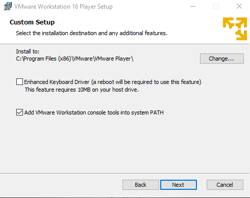
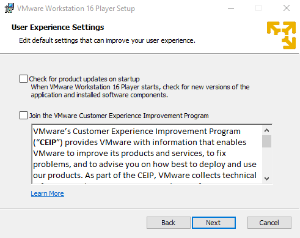
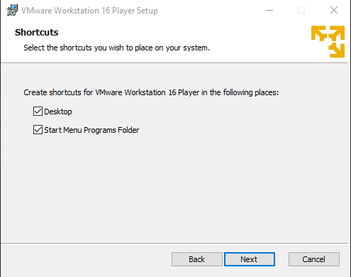
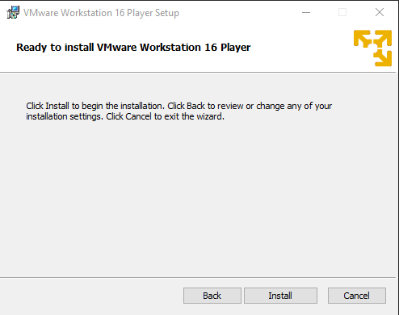
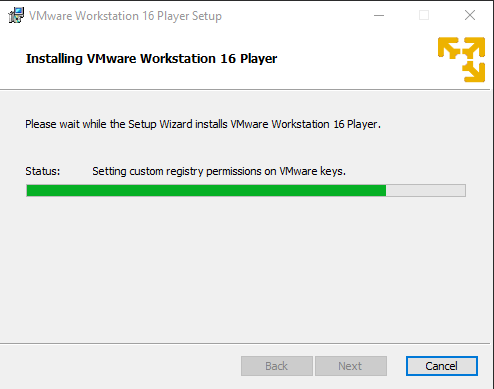
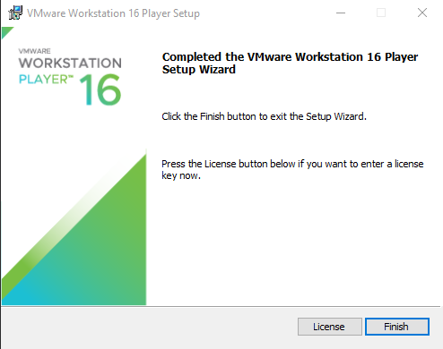
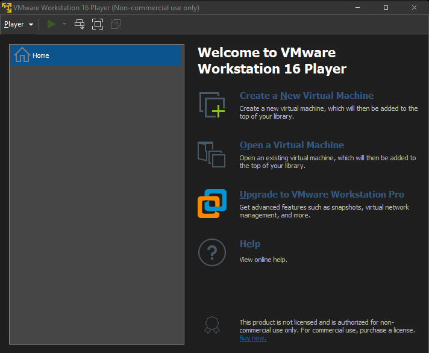

# Instalasi VMware di Windows

1. Klik *Next* untuk menginstall VMware

</[>

2. Centang *I accept the term...* lalu klik *Next*

</[>

3. Klik *Next*

</[>

4. Klik *Next*

</[>

5. Klik *Next*

</[>

6. Klik *Install* 

</[>

7. Tunggu proses instalasi selesai

</[>

8. Klik Finish

</[>

# Tampilan VMware Versi 16

</[>
