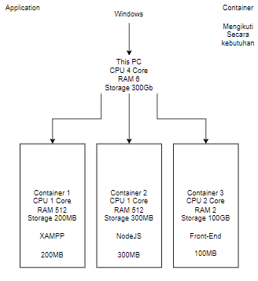

# Introduction to DevOps

DevOps : Praktik dalam sebuah pengembangan Software yang Menghubungkan antara tim Developer dengan tim Operation agar terotomatisasi hingga tahap rilis publik.

Tujuan : Agar proses deploy perubahan / update suatu software menjadi terotomatisasi dan mencegah apabila suatu code yg dibuat tim developer crash dengan software lama.

## Alur DevOps & Konsep CI/CD

- Alur dimulai dari DevOps membuat rancangan perubahan / update yang diserahkan ke Developer (Programmer)
- Developer membuat code
- Debeloper memberikan code ke DevOps
- DevOps melakukan release. jika ada masalah maka dikembalikan ke Developer untuk diperbaiki
- Jika tidak DevOps melakukan deploy ke publik
- kemudian DevOps memantau software

## Virtualization & Container

- Virtualization : Suatu metode untuk membuat Virtual Machine untuk minginstal berbagai Operation System dalam satu hardware dengan spesifikasi yang ditentukan diawal pembuatan.

- Container : Suatu metode untuk membuka berbagai aplikasi sesuai dengan spesifikasi kebutuhan aplikasi tersebut

## Cloud Computing

Cloud Computing adalah metode penyampaian berbagai layanan melalui internet. Seorang DevOps harus paham mengenai Cloud Computing karena berhubungan dengan penyimpanan secara publik agar bisa diakses oleh user dimana saja dan kapan saja.

