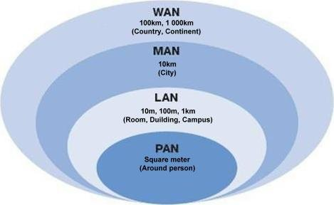
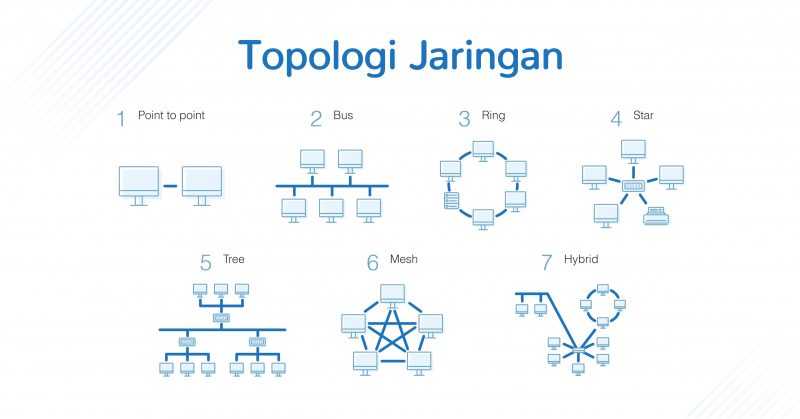

# Topology and Basic Network

Tugas Rangkuman Meeting 2

## Basic Network

Basic Network : hubungan antara 2 atau lebih komputer baik melalui kabel maupun non-kabel

### Tipe Network

- PAN (Personal Area Network) : jaringan komputer yang dipakai untuk berkomunikasi antar komputer dengan perangkat lain. Contoh:Laptop dengan SmartPhone

- LAN (Local Area Network) :jaringan komputer yang memiliki cakupan wilayah kecil seperti jaringan komputer pada kampus, sekolah, gedung, di dalam rumah, kantor dan satu ruangan lainnya. Contoh : Internet Rumah, Lab Komputer Sekolah, dll.

- MAN (Metropolitan Area Network) : sebuah jaringan di dalam satu kota dengan transfer data berkecepatan tinggi yang menjadi penghubung banyak lokasi seperti perkantoran, kampus, pemerintahan, dll. Contoh : Jaringan Bank, Perkantoran, dll.

- WAN (Wide Area Network) : jaringan komputer yang mencakup area sangat besar seperti contohnya jaringan komputer antar wilayah, kota dan negara yang butuh router serta saluran komunikasi publik. Contoh : Internet, Satelit.

Tipe Jaringan Komputer : 

- peer to peer : Model jaringan yang dapat memberikan kedudukan yang sama terhadap komputer, tak ada yang bertindak sebagai server atau client sehingga tidak ada media penyimpanan yang bersifat umum. Pada model ini dua komputer dapat berhubungan secara langsung tanpa tergantung pada server.

- Client-Server : Model jaringan yang memiliki client dan server. Client ialah komputer yang meminta layanan (dapat berupa data atau perangkat keras misalnya printer), sementara server ialah komputer yang bertindak untuk melayani permintaan client.

## Topology Network

- Topology Ring : Komputer saling terhubung dan akan kembali menghubungkan ke komputer awal. Topologi ini bisa dibilang tidak efisien, karena setiap paket yang dikirimkan oleh suatu komputer ke komputer lain, paket tersebut harus melewati satu titik ke titik lainnya baru sampai ke komputer tujuan.

- Topologi Bus : Topologi ini bersifat memberikan station/pemberhentian disetiap kabel yang bercabang. Ketika ada paket data yang mengarah ke suatu tempat, maka setiap komputer yang berada pada topologi tersebut, akan mendapat paket yang dikirim. Namun hanya komputer tujuan saja yang membalas/mereply paket yang dikirimkan.

- Topologi Star : Data yang dikirimkan dari pc ke pc lainnya akan langsung menuju lokasi alamat tujuan tanpa harus melewati komputer-komputer yang tidak berkaitan dengan paket yang dikirimkan.

- Topologi Mesh : Topologi yang langsung terhubung antar pc di setiap link. Sehingga, setiap pc yang menggunakan topologi ini akan memiliki link (jalur) yang lebih cepat untuk sampai ke tujuannya.

## IP Address

IP Address : barisan angka yang dimiliki setiap perangkat yang terhubung dengan internet. Deretan angka-angka ini berbeda antara satu perangkat dengan lainnya dan digunakan agar saling berhubungan dalam jaringan internet.

### Versi IP Address : 

- IPv4 : Struktur alamat IPv4 memiliki panjang angka 32 bit, yang terdiri dari 4 blok angka yang dipisahkan dengan titik. Setiap blok bisa berisi 1 hingga 3 digit angka. Masing-masing kumpulan angka tersebut adalah representasi desimal dari 8 bit angka biner. IPv4 terdiri dari 4 oktet, yang setiap oktetnya dapat menampung 255 alamat. IPv4 memiliki rentang antara 0.0.0.0 hingga 255.255.255.255. Jadi, jika dihitung IPv4 dapat menampung sebanyak 4,3 miliar alamat.

- IPv6 :Struktur IPv6 terdiri dari kombinasi angka dan huruf. IPv6 memiliki panjang angka 128 bit, terdiri dari 8 kelompok angka dan huruf yang setiap kelompoknya dipisahkan dengan titik dua.
  
### Jenis - Jenis IP Address

- IP Public : Menghubungkanmu dengan jaringan internet secara global.
  
- IP Privat : digunakan hanya untuk jaringan lokal. IP Privat biasanya digunakan untuk sistem jaringan lokal (LAN) seperti misalnya yang digunakan di perkantoran, hotel, dll.
  
- IP Dinamis dapat berubah sewaktu-waktu. Hal tersebut terjadi karena jumlah alamat IP yang kian menipis, maka penggunaannya pun bergantian. Jenis IP Dinamis biasanya digunakan untuk umum.
  
- IP Statis : IP Statis tidak akan berubah-ubah. Penggunanya melakukan pemesanan khusus terhadap alamat IP kepada ISP dengan membayar sejumlah biaya. IP Statis biasanya digunakan oleh penyedia server, web hosting, ataupun lembaga penting yang sangat bergantung pada layanannya.
  
- Shared IP : jenis alamat IP yang digunakan oleh beberapa domain/situs dalam satu server yang sama. Alamat IP jenis ini biasanya dipakai pada layanan shared hosting.
  
- Dedicated IP : Alamat IP jenis ini hanya dimiliki oleh satu domain/situs saja. Dengan menggunakan Dedicated IP, reputasi domain pengguna tidak terpengaruhi oleh domain lainnya. Dedicated IP umumnya digunakan oleh pengguna cloud VPS hosting dan pengguna dedicated hosting.
