## Dokumentasi Basic Shell Linux

- `ls`     : untuk menampilkan list direktori/file
- `ls -a`  : untuk menampilkan list direktori/file beserta direktori/file hidden
- `ls -l`  : untuk menampilkan list direktori/file beserta jenis, akses permission, user, dan size
- `ls -la` : untuk menampilkan list direktori/file baik hidden maupun tidak beserta jenis, akses permission, user, dan size

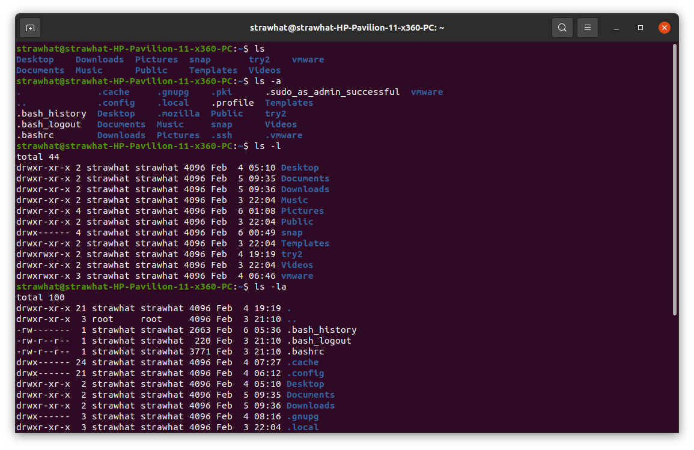

- `mkdir nama-dir`     : untuk membuat direktori/folder
- `touch namafile`     : untuk membuat file
- `rm namafile`        : untuk menghapus file
- `rm -d namadir`      : untuk menghapus direktori kosong
- `rm -r namadir/file` : untuk menghapus direktori berisi
- `rm -f namafile`     : untuk menghapus file secara paksa

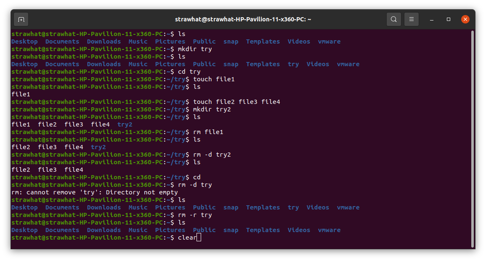

- `cd namadir` : untuk merubah/masuk ke direktori
- `cd ..`      : untuk keluar satu slash ke direktori sebelumnya
- `cd`         : untuk keluar ke direktori user
- `cd ../..`   : untuk keluar dua slash ke direktori sebelumnya
- `pwd`        : untuk mengetahui lokasi parent folder yang sedang dibuka

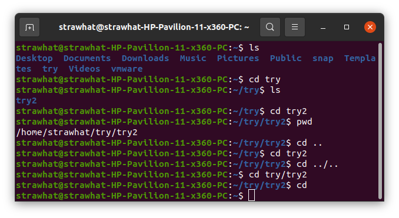

- `cp file-yg-ingin-dicopy nama-file-copy` : untuk mencopy file
- `mv namafilebefore namafileafter` : untuk me-rename file
- `mv namafile namadir/` : untuk memindah file ke direktori tujuan

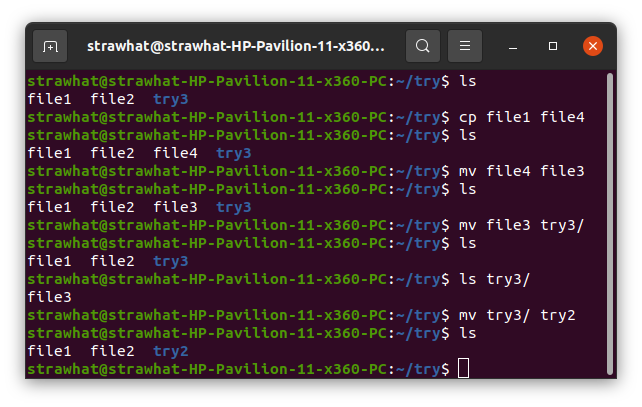

- `cat namafile` : untuk menampilkan isi file dalam bentuk text
- `echo 'isi file' > namafile`  : untuk mereplace isi file
- `echo 'isi file' >> namafile` : untuk menambahkan isi file

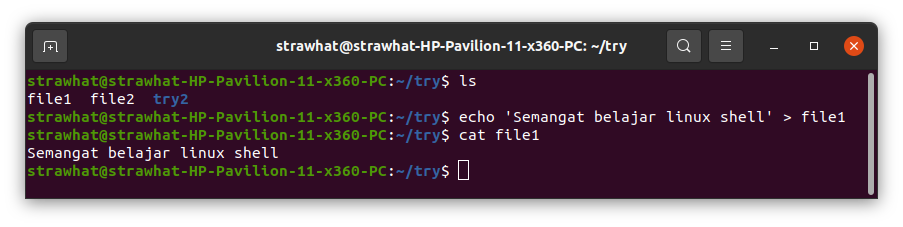

- `sed 's/kata-yg-ingin-diganti/kata-pengganti/g' namafile` : untuk mengganti kata terpilih secara sementara/sekali
- `sed -i 's/kata-yg-ingin-diganti/kata-pengganti/g' namafile` : untuk mengganti kata terpilih permanent

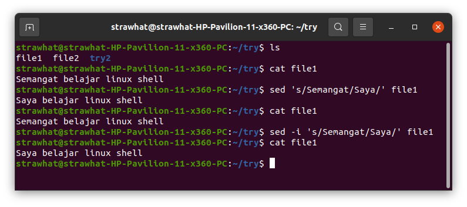

- nano : text editor default
- `nano --version`  : untuk melihat versi nano
- `nano namafile` : untuk merubah isi dari file

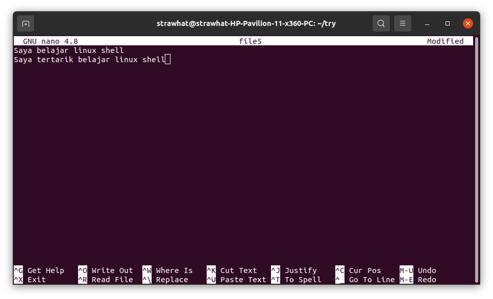

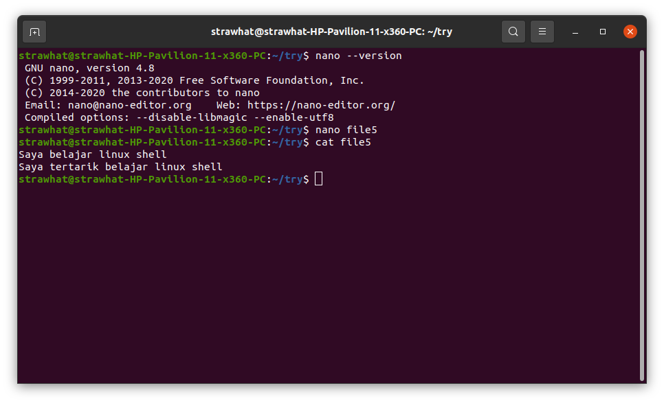

- `sort namafile`    : untuk menampilkan dan mengurutkan isi dari file secara ascending
- `sort -r namaifle` : untuk menampilkan dan mengurutkan isi dari file secara descending

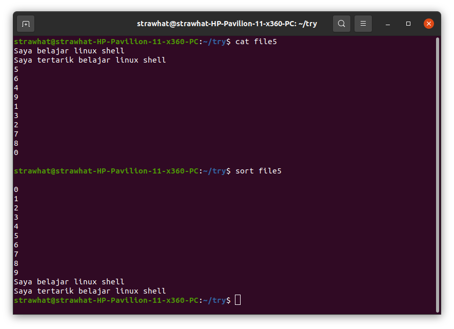

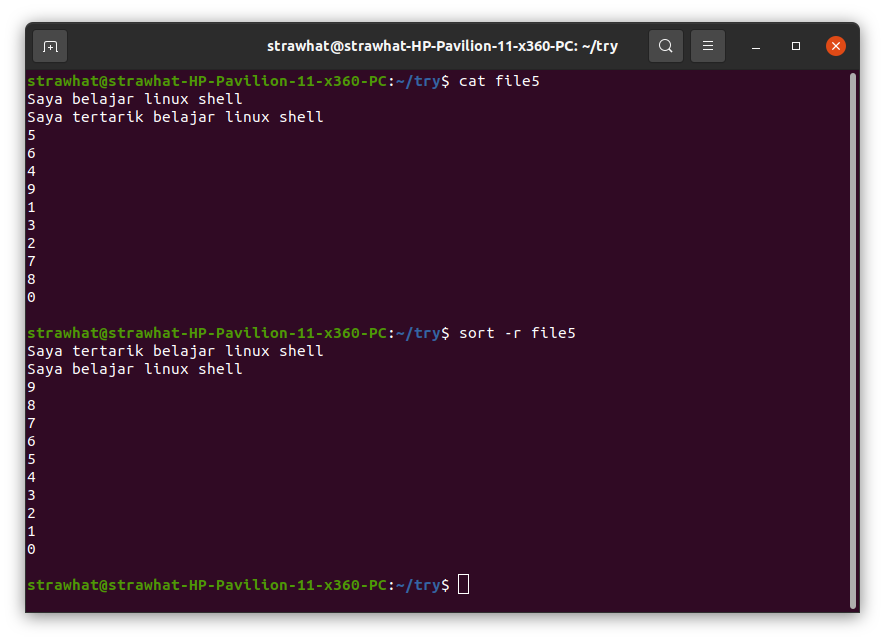

- `grep kata-yg-ingin-dicari namafile` : untuk mencari kata dalam file
- `grep -c kata-yg-ingin-dihitung namafile` : untuk menghitung jumlah kata yg digunakan dalam file

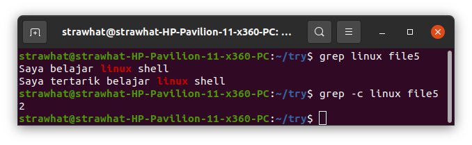

- `find -type f -name namafile` : untuk mencari nama suatu file
- `find -type d -name namadir`  : untuk mencari nama suatu direktori

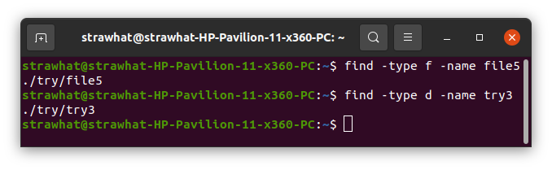

- `history` : untuk menampilkan riwayat perintah
- `history | grep namaperintah` : untuk menampilkan riwayat perintah sesuai kata yg dicari

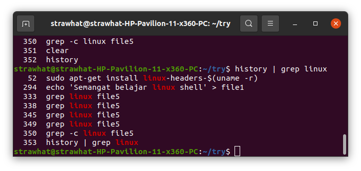

- `wget link-download` : untuk mendownload

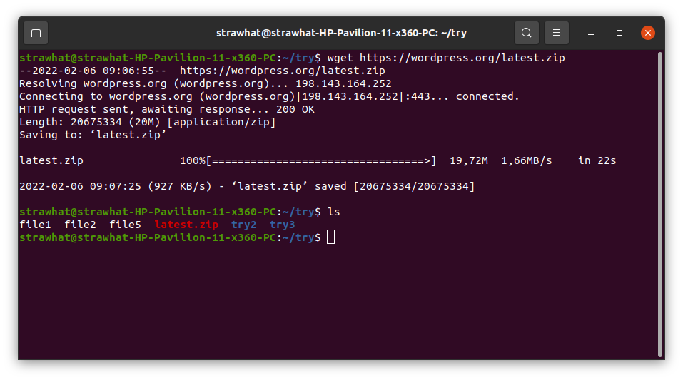

- `sudo su` : untuk masuk ke direktori root
- `exit`    : untuk keluar dari root
- `sudo apt install nama-aplikasi-yg-ingin-diinstall` : untuk menginstall aplikasi
- `sudo apt autoremove nama-aplikasi` : untuk menghapus aplikasi

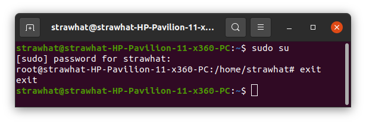

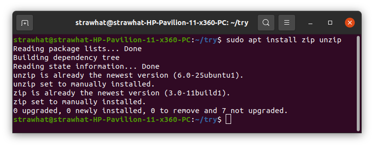

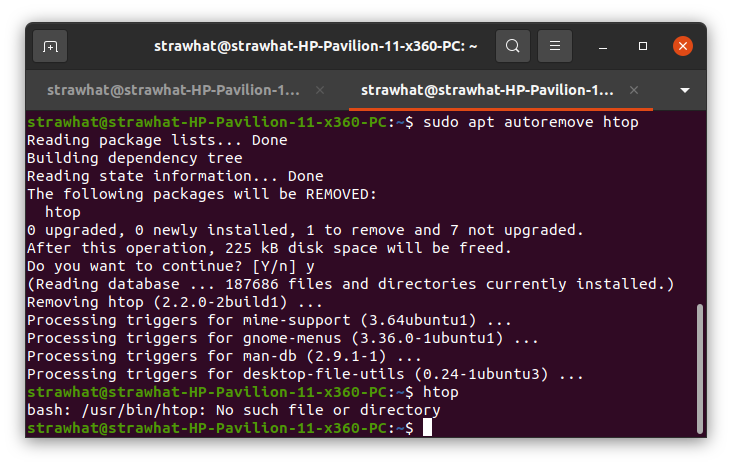

- `zip namafile/direktori` : untuk mencompress file/direktori
- `unzip namafilezip`      : untuk mengekstrak file.zip

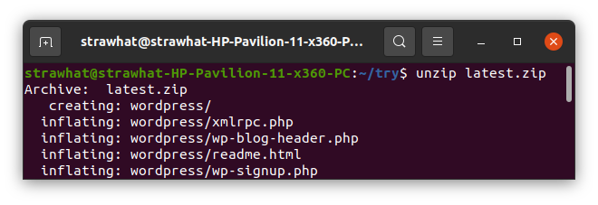

- `sudo adduser nama` : untuk menambahkan user
- `sudo deluser nama` : untuk menghapus user
- `sudo usermod -aG sudo su nama` : untuk memberi izin root kepada user yg disebut
- `sudo su - nama` : untuk pindah ke user yg disebut
- `exit` : untuk kembali ke user utama

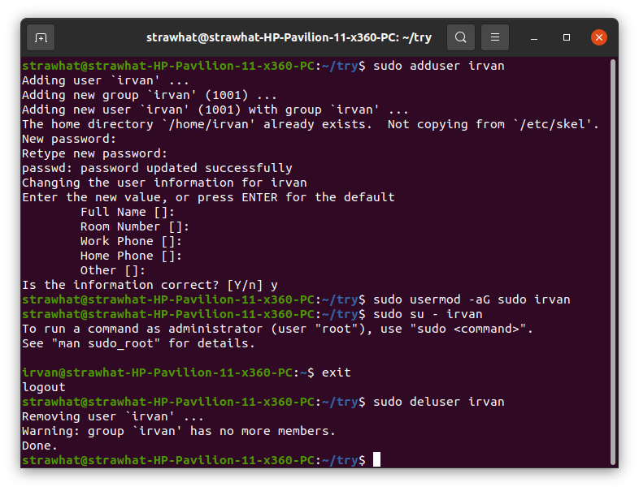

- `ping google.com` : untuk mengetes koneksi internet

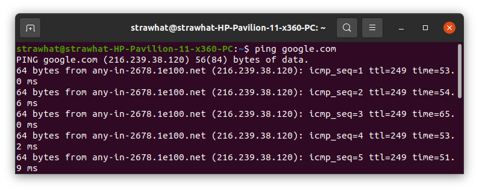

- `sudo chmod u-rwx (namafile/dir)` : untuk menghapus izin akses kepada user untuk r=read, w=write, dan x-execute dari file/direktori
- `sudo chmod u+rwx (namafile/dir)` : untuk memberi izin akses kepada user untuk r=read, w=write, dan x-execute dari file/direktori
- `sudo chmod g-rwx (namafile/dir)` : untuk menghapus izin akses kepada group untuk r=read, w=write, dan x-execute dari file/direktori
- `sudo chmod g+rwx (namafile/dir)` : untuk memberi izin akses kepada group untuk r=read, w=write, dan x-execute dari file/direktori
- `sudo chmod o-rwx (namafile/dir)` : untuk menghapus izin akses kepada user lain untuk r=read, w=write, dan x-execute dari file/direktori
- `sudo chmod o+rwx (namafile/dir)` : untuk memberi izin akses kepada user lain untuk r=read, w=write, dan x-execute dari file/direktori

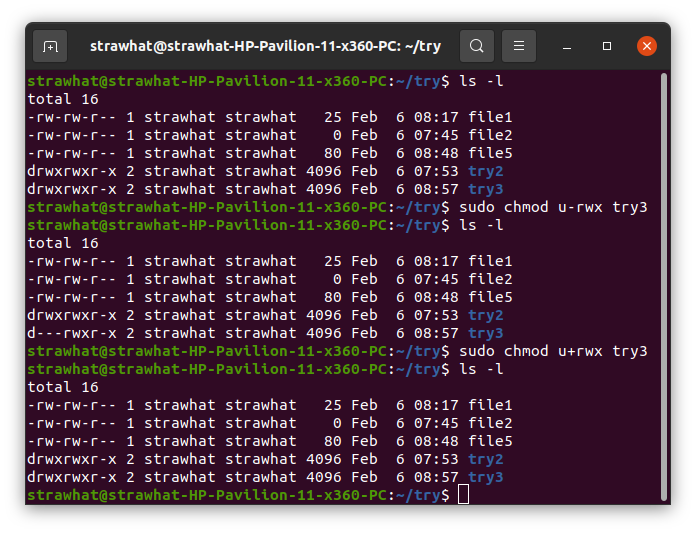

- `sudo chown (namauser):(namagroup) (namafile/dir)` : untuk merubah kepemilikan suatu file/dir kepada user lain 

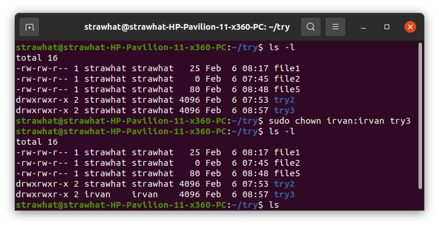

