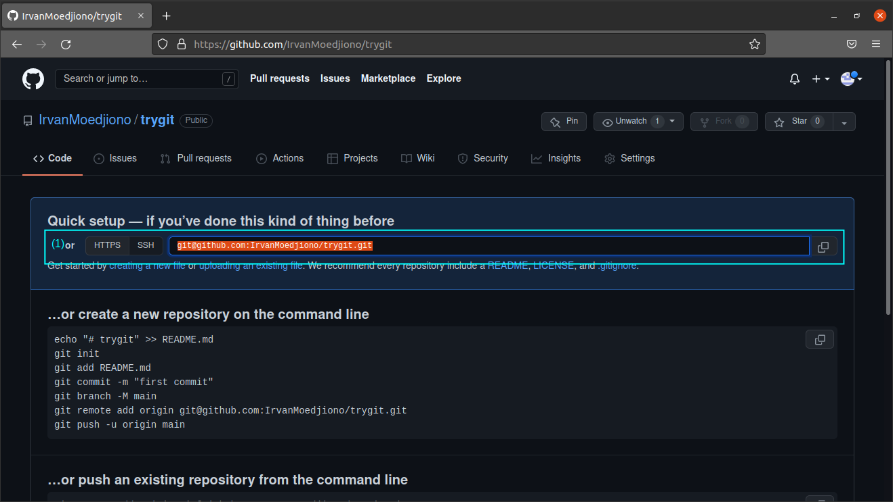
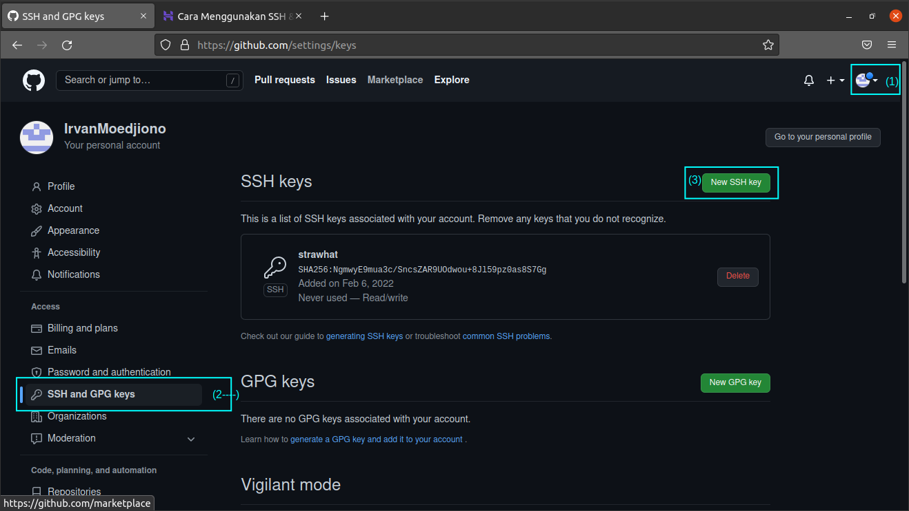

## Dokumentasi Version Control Git

- git --version        : untuk mengecek versi dari git
- sudo apt install git : untuk menginstall git

- git config --global user.name "(usernamegithub)" : untuk configurasi username git secara global
- git config --global user.email "(emailgithub)"   : untuk configurasi email git secara global
- git config --list : untuk menampilkan daftar configurasi

- git init (namadir) : untuk membuat direktori yang terinisialisasi git (menjadi repositori git)

- nano .gitignore : untuk mengasingkan file saat proses push

- git add .  : untuk menambahkan semua perubahan agar siap dicommit
- git status : untuk melihat status git

- git commit -m "(komentar)" : untuk commit file agar siap untuk dipush

- git branch -m (namabranch) : untuk membuat branch baru dan pindah kebranch tersebut
- git remote add (namaremote) (ssh-repositori-github) : untuk menambahkan remote repositori
- git push (nama-remote) (nama-branch) : untuk push/upload ke github

SSH Remote repositori

- git branch (nama-branch) : untuk membuat branch baru tetapi tidak langsung pindah ke branch baru
- git branch -a : untuk melihat daftar branch dan sedang memakai branch apa
- git checkout (nama-branch) : untuk pindah ke branch lain yang disebutkan

- git pull (nama-remote) (nama-branch-yg-dicopy) : untuk menyalin suatu branch

- git clone (ssh-key-repositori-github) : untuk menyalin dan mengunduuh repositori di github

- git branch -d (nama-branch) : untuk menghapus branch lokal
- git push (nama-remote) --delete (nama-branch) : untuk menghapus branch public

### Generate SSH key ke Github

- ssh-keygen            : untuk membuat ssh key komputer kita
- ssh -T git@github.com : untuk memeriksa apakah sudah terkoneksi ke github

1. ketik perintah 'ssh-keygen' diterminal untuk membuat dan menyimpan ssh key. Untuk "enter file in which..." dan passphrase bisa diskip dengan tombol enter. Setelah selesai masuk ke direktori .ssh dengan perintah 'cd .ssh'. Lihat ssh key pada file id_rsa.pub dengan perintah 'cat id_rsa.pub' dan copy semua isinya.

2. Masuk ke Githib, pilih setting (1), pilih SSH and GPG keys (2), pilih New SSh key (3).

3. Masukkan SSH key yang sudah tercopy tadi kedalam kotak biru, lalu isikan nama/title. Setelah selesai klik add SSH key, lalu masukkan password github

4. Kembali ke terminal, ketik ssh -T git@github.com untuk memeriksa apakah sudah terkoneksi ke github

### Study Case Git Merge on Process Development, Staging, and Production

1. Branch development merupakan ruang kerja bagi developer untuk membuat perubahan, testing, dll. pada branch developer.

2. Branch staging merupakan ruang kerja bagi QA untuk menguji code baik manual/otomatis yang dibuat developer di branch development. Untuk membuat branch staging sama dengan branch development dibutuhkan perintah git merge.

3. Branch Production merupakan tahap yang siap diluncurkan kepada user/customer. Apabila ada kerusakan sistem bisa dikembalikan ke versi sebelumnya dengan cara merge dari branch staging.
