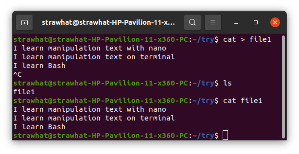
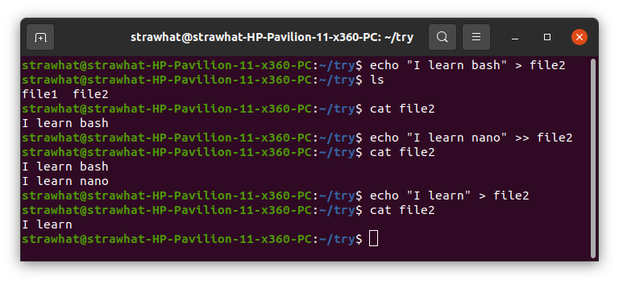
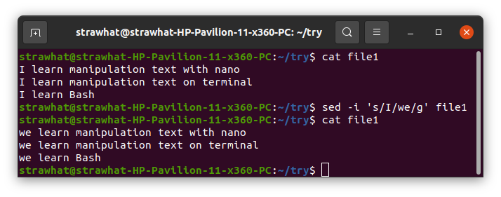
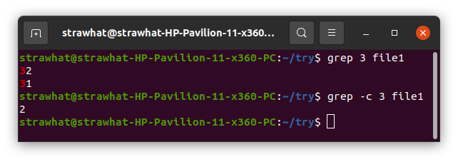
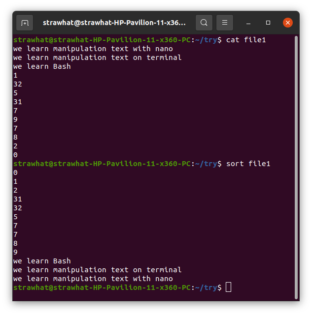
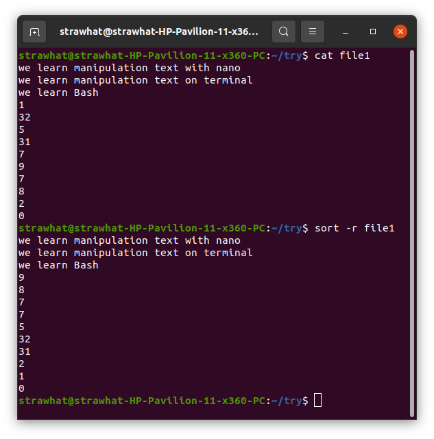

## Manipulation Text with Terminal

- cat : untuk melihat teks dalam file
- cat > (nama-file) : Untuk membuat sekaligus menulis teks dalam file
- CTRL+C : untuk menghentikan perintah pada terminal

- echo "(teks)" > (nama-file)  : untuk me-replace teks dalam file
- echo "(teks)" >> (nama-file) : untuk menambahkan teks di baris baru dalam file

- sed -i 's/(teks-yg-ingin-diganti)/(teks-pengganti)/g' (nama-file)

- grep (teks-yg-ingin-dicari) (nama-file) : untuk mencari teks dalam file
- grep -c (teks-yg-ingin-dihitung) (nama-file) : untuk menghitung berapa banyak teks yg digunakan dalam satu file

-sort (nama-file) : untuk mengurutkan teks per baris dalam dalam file secara ascending

-sort -r (nama-file) : untuk mengurutkan teks per baris dalam dalam file secara descending

