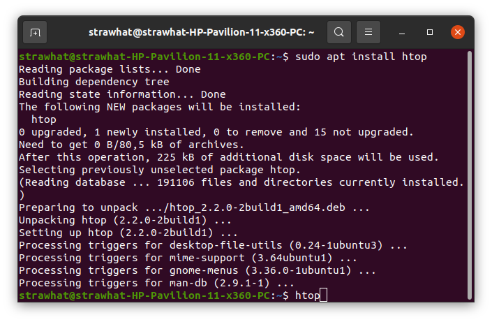
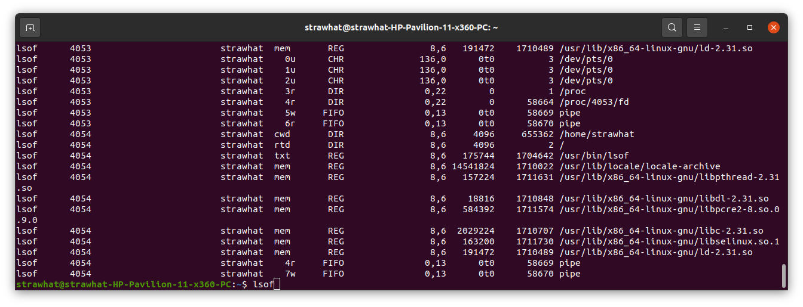
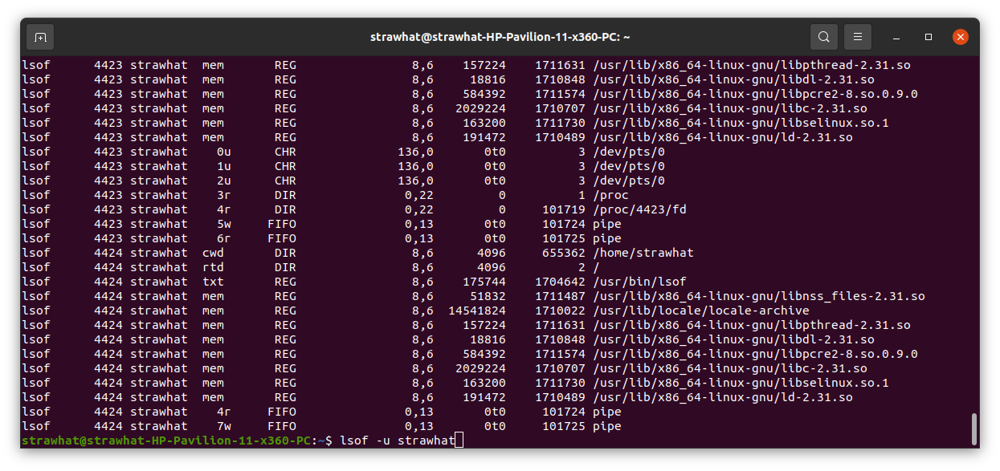
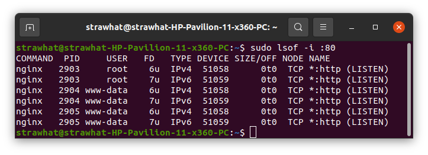
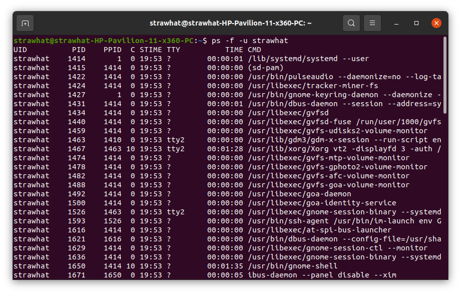
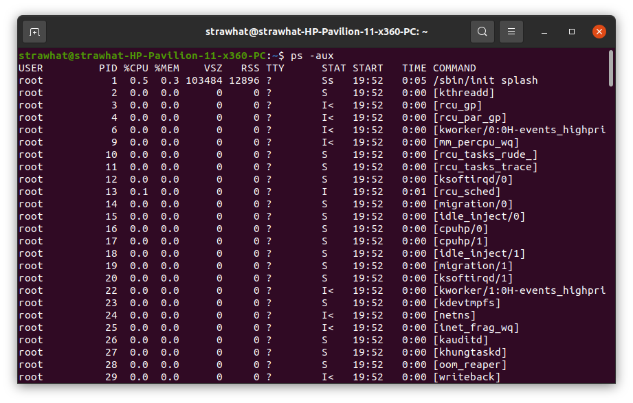
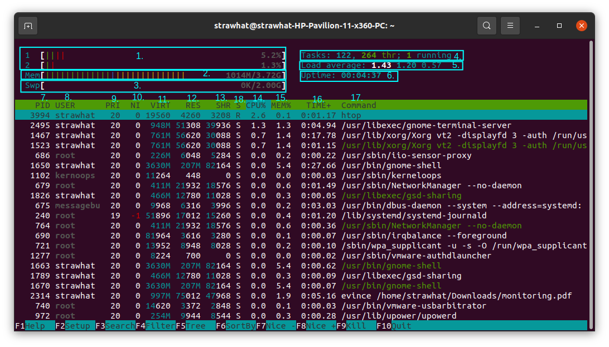

## Monitoring with Terminal

    Monitoring suatu server adalah kegiatan memantau kinerja yang sedang berjalan pada suatu server. Monitoring bertujuan untuk mendapatkan informasi tentang kesehatan dan peforma server, serta mengetahui apabila terjadi suatu masalah pada server.

- `sudo apt install htop` : untuk menginstal htop
- `htop` : untuk membuka htop

- `lsof` : untuk menampilkan semua daftar system yang berjalan saat perintah dibuat
- `lsof -u nama-user` : untuk menampilkan daftar system yang berjalan pada user yang disebutkan saat perintah dibuat

- `sudo lsof -i :nama-port` : untuk menampilkan daftar system yang berjalan pada port yang disebutkan saat perintah dibuat

- `ps -f -u nama-user` : untuk menampilkan system yang berjalan pada user yang disebutkan saat perintah dibuat

- `ps -aux` : untuk menampilkan semua daftar system yang berjalan saat perintah dibuat

## Htop

1. melihat status core proccessor yang digunakan
2. melihat status memori RAM yang digunakan
3. melihat status memori swap yang digunakan
4. melihat jumlah task yang berjalan
5. melihat waktu memuat rata rata
6. melihat berapa lama system berjalan dari saat computer dinyalakan pertama kali
7. PID : Proses ID
8. USER : nama user pemilik proses
9. PRI : nilai proses prioritas, semakin tinggi nilai semakin diprioritaskan
10. NI : nice value, berpengaruh pada nilai prioritas
11. VIRT : banyaknya virtual memori yang digunakan
12. RES : banyaknya RAM yg digunakan dalam satuan kilobyte
13. SHR : banyaknya shared memori yang digunakan 
14. CPU% : persentase penggunaan CPU
15. MEM% : persentase penggunaan RAM
16. TIME+ : Berapa lama proses berjalan
17. COMMAND : Nama perintah dari proses yg digunakan
18. S : status proses. S=sleeping, R=running
