## Network Firewall

Network Firewall adalah sistem keamanan jaringan komputer yang bertujuan mengontrol semua akses keluar/masuk suatu jaringan berdasarkan aturan yang telah ditetapkan. Network Firewall memiliki fungsi melindungi data/system dari serangan hacker dan mampu memblok konten yang tidak diinginkan.

- `sudo apt install ufw` : untuk menginstall ufw

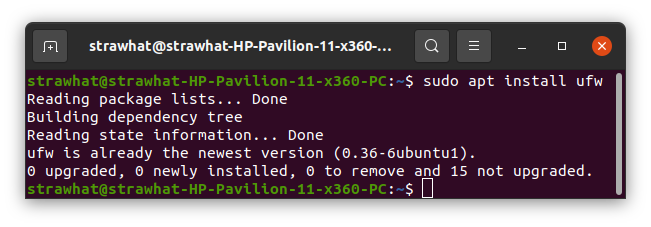

- `sudo ufw enable` : untuk mengaktifkan firewall

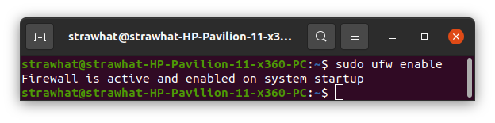

- `sudo ufw disable` : untuk menonaktifkan filrewall

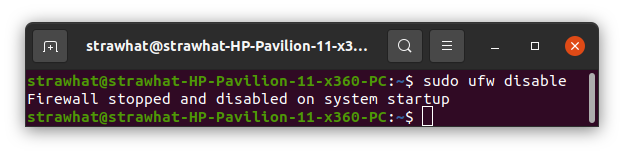

- `sudo ufw default deny incoming`  : untuk melarang semua akses yg masuk
- `sudo ufw default allow outgoing` : untuk mengizinkan semua akses yg masuk

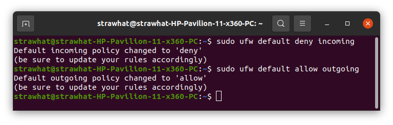

- `sudo ufw app list` : untuk menampilkan daftar aplikasi yang dapat menggunakan firewall
- `sudo ufw allow "Nginx Full"` : untuk memberi akses full nginx

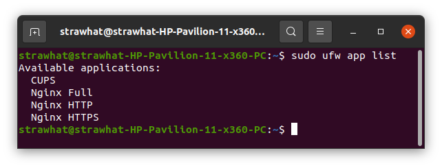

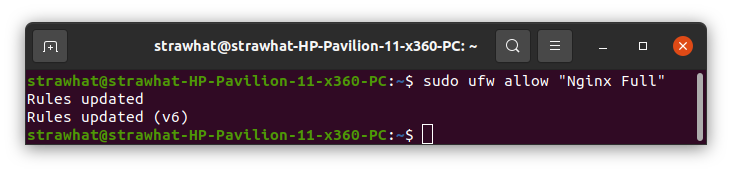

- `sudo ufw allow 22` : untuk mengizinkan akses pada port 22

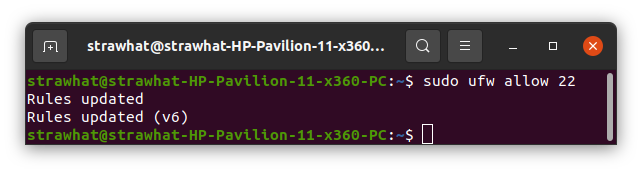

- `sudo ufw deny 80` : untuk melarang akses pada port 80

- `sudo ufw allow 22/tcp` : untuk mengizinkan akses port 22 dengan koneksi TCP

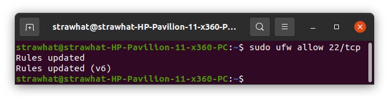

- `sudo ufw allow 22/udp` : untuk mengizinkan akses port 22 dengan koneksi UDP

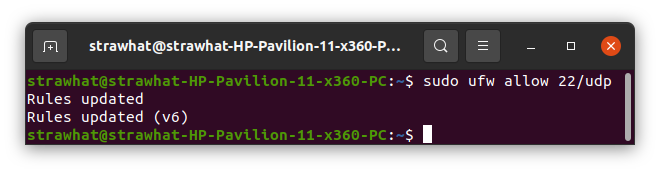

- `sudo ufw status` : untuk menampilkan status firewall

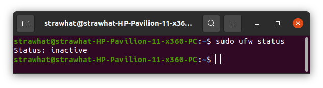

- `sudo ufw verbose` : untuk menampilkan status dan daftar perintah firewall

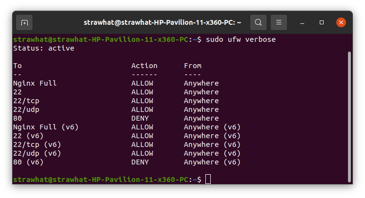

- `sudo ufw delete deny/allow nama-port` : untuk menghapus aturan yg dibuat

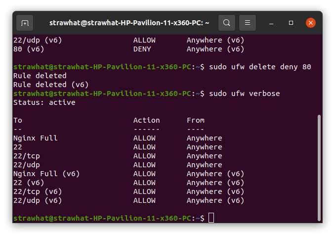

