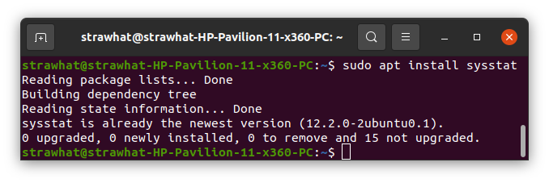
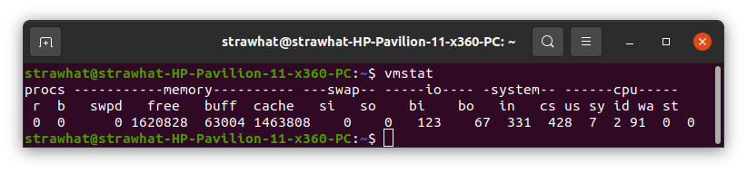
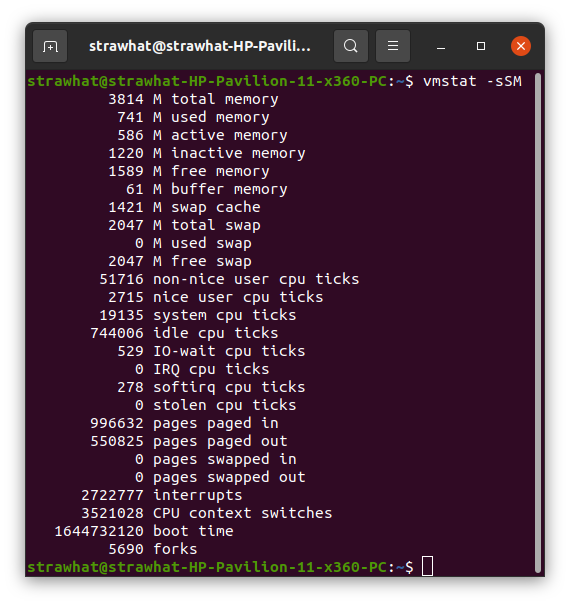
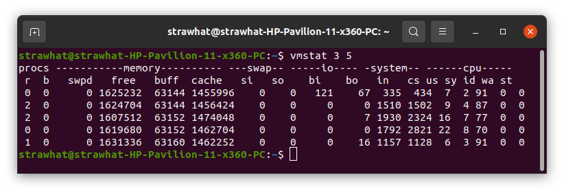
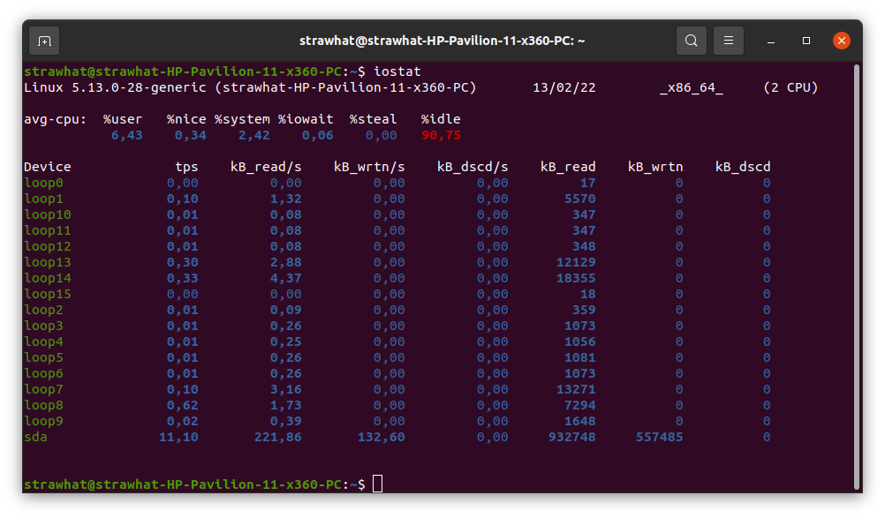
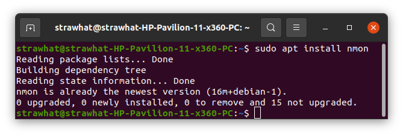
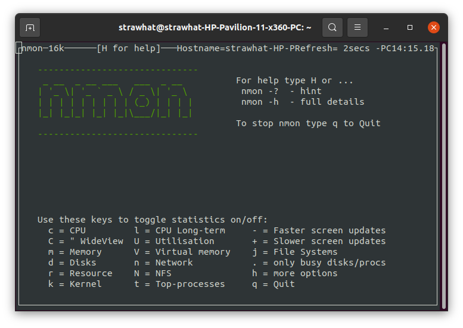
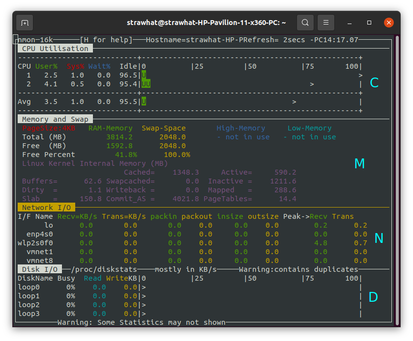

## System Performance

System Performance merupakan peforma dari system berdasarkan hardware yang digunakan.

- `sudo apt install sysstat` : untuk menginstal vmstat

- `vmstat` : untuk menampilkan penggunaan memori, swap, I/O speed, CPU.

- `vmstat -sSM` : untuk menampilkan penggunaan memori

- `vmstat 3 5` : untuk menampilkan data system sebanyak 5 kali setiap 3 detik

- `iostat` : untuk memantau system input dan output

- `sudo apt install nmon` : untuk menginstal nmon

