## Teks Editor Nano

Teks editor Nano adalah teks editor default bawaan dari terminal linux. Berfungsi untuk memanipulasi teks di terminal tanpa meskipun tanpa GUI (Graphic User Interface)

## Dokumentasi Shortcut teks editor Nano

- Untuk membuka teks editor nano pada terminal ketik perintah "nano"

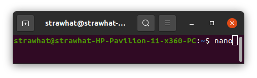

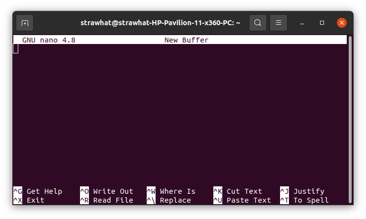

- nano (nama-file) : Untuk membuat file sekaligus membuka teks editor nano. Jika nama file sudah ada maka perintah tersebut hanya untuk membuka file dengan menggunakan nano.

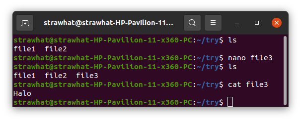

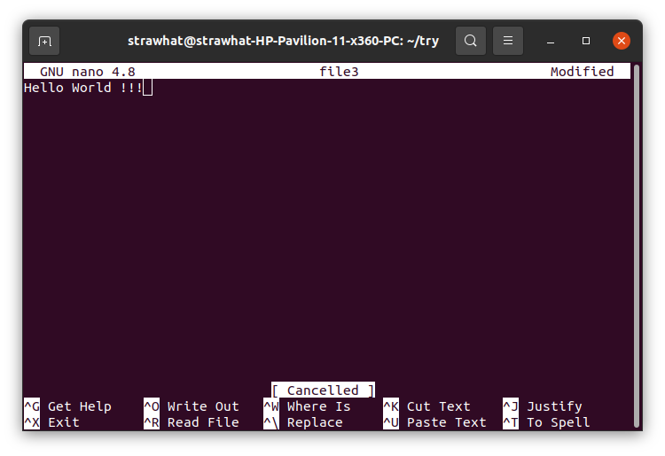

- CTRL+O : Shortcut untuk menyimpan perubahan text tetapi tidak keluar teks editor nano

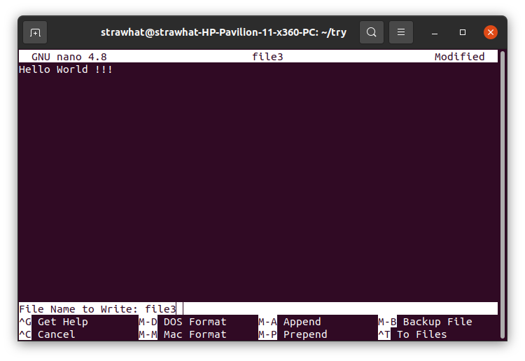

- CTRL+X : Untuk keluar sekaligus kita mau menyimpan perubahan atau tidak dengan perintah y=yes, n=no, dan ctrl+c=cancel

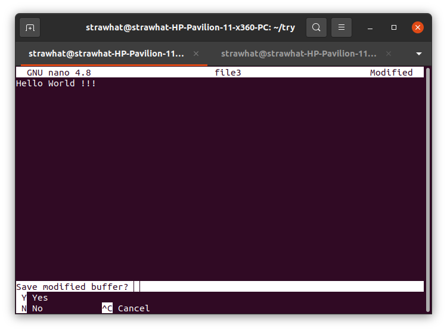

- CTRL+A : untuk pindah cursor ke depan suatu baris
- CTRL+E : untuk pindah cursor ke belakang suatu baris

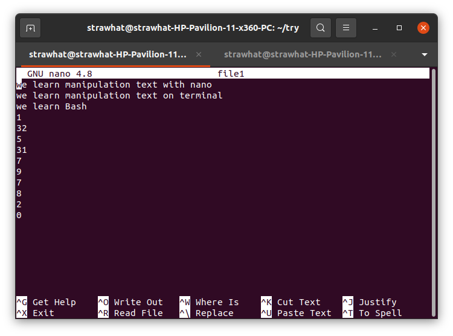

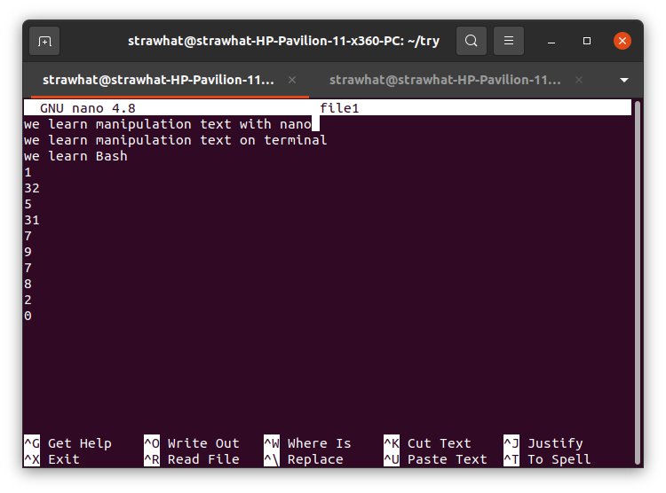

- CTRL+W : untuk pindah cursor ke lokasi yang kita cari berdasarkan kata yg kita cari

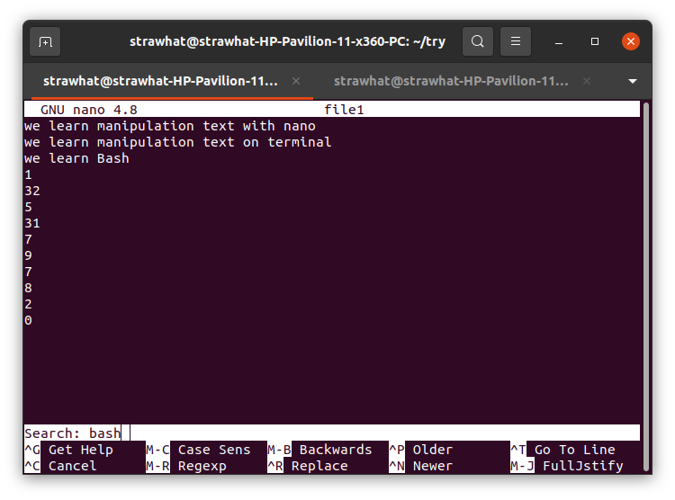

- ALT+A : untuk memilih text dengan cara tombol panah kiri/kanan

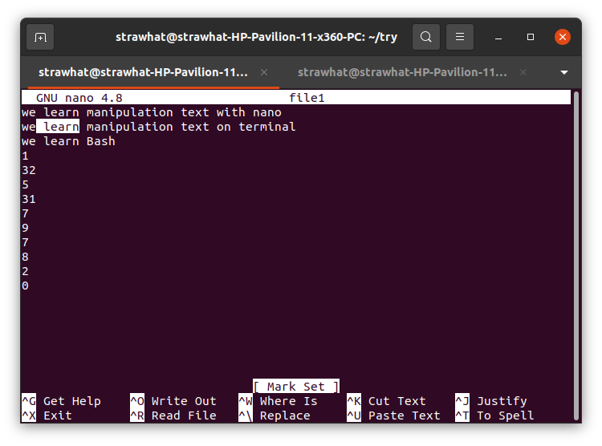

- CTRL+K : untuk cut sekaligus mencopy teks
- CTRL+U : untuk paste teks yang sudah tercopy

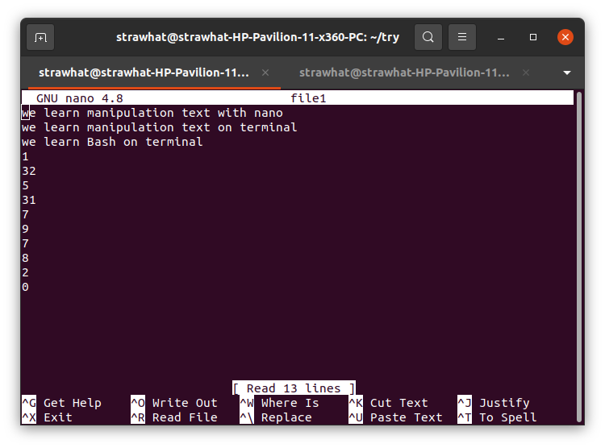

- CTRL+R : untuk menyalin isi dari file lain dengan cara memasukkan alamat file yg ingin kita salin 

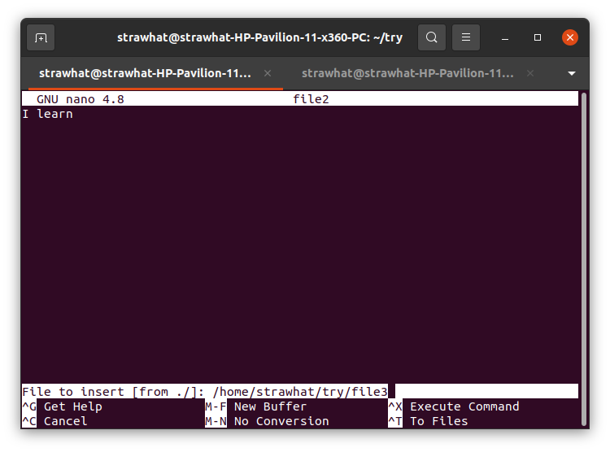

- CTRL+J : untuk membuat beberapa baris menjadi satu baris, jika tidak muat maka dilanjutkan baris selanjutnya

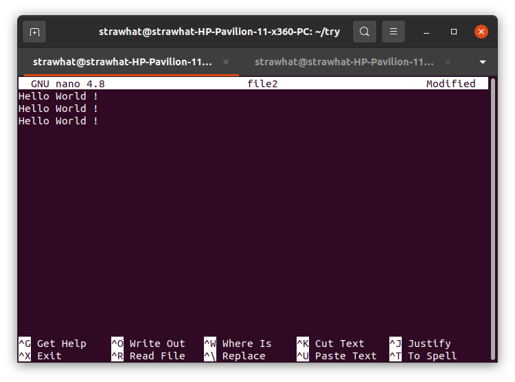

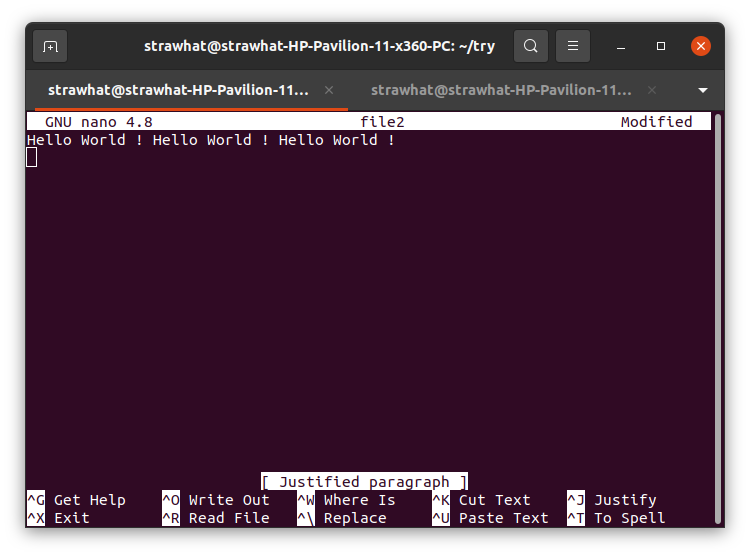

