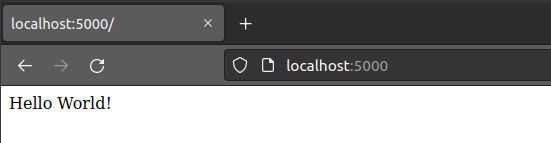
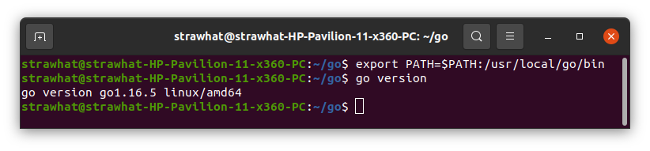

## Create Simple Aplication

Aplication : Software yang melakukan fungsi spesifik secara langsung untuk pengguna akhir. Aplikasi dapat berjalan secara mandiri atau secara bersamaan dengan sekelompok program.

### Node.js

- `curl -o- https://raw.githubusercontent.com/nvm-sh/nvm/v0.39.1/install.sh | bash` : untuk download version manager dari node.js

- `exec bash` : untuk menjalankan bash

- `nvm install 14` : untuk menginstall node.js versi 14
- `nvm use 14` : untuk menggunakan/pindah versi node.js
- `node -v` : untuk mengecek versi dari version manager node.js
- `npm -v` : untuk mengecek versi dari paket manager node.js

- `npm init -y` : untuk inisialisasi direktori aplikasi menjadi node.js

- `npm install express --save` : untuk menginstall modul node.js

- `nano index.js` : untuk membuat file index.js

Copy perintah pada gambar dibawah ini ke index.js untuk membuat aplikasi hello world!

- `node index.js` : untuk menjalankan aplikasi node.js

Buka web browser ketik alamat localhost:3000

### Python

- `sudo apt install python3-pip` : untuk menginstall python package manager

- `pip install flask` : untuk menginstall flask python

Buat direktori untuk aplikasi python > masuk direktori yg sudah dibuat > buat file index.py `nano index.py` > copy script simpel hello world dibawah > simpan > jalankan dengan perintah `python3 index.py` > buka web browser dan masukkan alamat `localhost:5000`

### Golang

- `wget https://golang.org/dl/go1.16.5.linux-amd64.tar.gz && sudo su` : untuk download Golang dan masuk ke user root

- `rm -rf /usr/local/go && tar -C /usr/local -xzf go1.16.5.linux-amd64.tar.gz && exit` : untuk menghapus instalasi go sebelumnya pada user root dan mengekstrak file Golang pada user root dan keluar user root

- `export PATH=$PATH:/usr/local/go/bin` : untuk memasukkan path Golang pada bashrc
- `go version` : untuk mengecek versi Golang

Buat script golang `nano index.go` dan copy script dibawah ini untuk simpel app golang > simpan > jalankan dengan perintah `go run index.go`

## Menjalankan dan Mengontrol lebih dari 1 aplikasi menggunakan pm2

pm2 : proses manager untuk aplikasi node.js yg berguna untuk membuat aplikasi menyala terus dan juga bisa menjalankan beberapa aplikasi.

- `npm install pm2 -g` : untuk menginstall pm2

- `pm2 start nama-dir-app` : untuk menjalankan aplikasi

- `pm2 list` : untuk menampilkan daftar aplikasi
- `pm2 stop nama-app` : untuk menghentikan aplikasi yang berjalan

- `pm2 restart nama-app` : untuk merestart aplikasi

- `pm2 delete nama-app` : untuk menghapus aplikasi dari daftar pm2

## Service Management

Service management adalah satu set kemampuan dari suatu aplikasi untuk menyediakan fitur manajemen semua aplikasi yang ada pada sistem operasi.

Fungsinya memberikan sebuah metode untuk mengaktifkan system resources, daemons dan proses lainnya baik itu ketika booting maupun ketika sistem berjalan.

- `sudo systemctl status nginx` : untuk melihat kondisi service nginx
- `sudo systemctl start nginx` : untuk menjalankan service nginx
- `sudo systemctl enable nginx` : untuk mengaktifkan fitur start service nginx secara otomatis ketika sistem operasi dinyalakan
- `sudo systemctl disable nginx` : untuk menonaktifkan fitur start service nginx secara otomatis ketika sistem operasi dinyalakan
- `sudo systemctl restart nginx` : untuk memulai ulang service nginx

