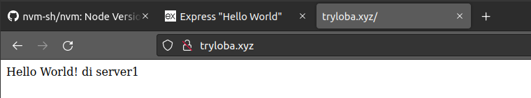
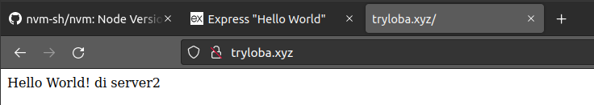

## Reverse Proxy

Reverse Proxy : sebuah fitur/modul di dalam sebuah webserver, yang berfungsi untuk melakukan port forwarding suatu request, dari public request menuju ke dalam sistem.

### Konfigurasi Reverse Proxy

1. Buka direktori nginx `cd /etc/nginx` > Buat direktori pada nginx untuk membuat configurasi baru > masuk folder > buat file menggunakan nano dan copy script dibawah > simpan dan keluar

2. Pindah ke direktori sebelumnya/nginx > buka dan edit file nginx.conf dengan nano > tambahkan `include /etc/nginx/irvan/*;` seperti gambar dibawah > simpan dan keluar > cek syntax dengan perintah `sudo nginx -t` > restart system nginx dengan perintah `sudo systemctl restart nginx`

3. Membuat Virtual host dengan perintah `sudo nano /etc/hosts` > Tambahkan `127.0.0.1 irvan.xyz` seperti gambar di bawah

4. Buka web browser dan ketik alamat irvan.xyz, maka akan tampil `502 Bad Gateway`. Karena aplikasi pada port 3000 belum dijalankan

5. Jalankan simple aplikasi hello world port 3000

6. Kembali ke web browser dan reload web irvan.xyz maka akan tampil seperti gambar dibawah ini

### Konfigurasi Load Balancing

0. Jalankan 2 buah server dan lakukan konfigurasi di bawah ini pada kedua server.

1. Buka direktori nginx `cd /etc/nginx` > Buat direktori pada nginx untuk membuat configurasi baru > masuk folder > buat file menggunakan nano dan copy script dibawah > simpan dan keluar

2. Pindah ke direktori sebelumnya/nginx > buka dan edit file nginx.conf dengan nano > tambahkan `include /etc/nginx/tryloba/*;` seperti gambar dibawah > simpan dan keluar > cek syntax dengan perintah `sudo nginx -t` > restart system nginx dengan perintah `sudo systemctl restart nginx`

3. Jalankan simple aplikasi hello world di kedua server

4. Membuat Virtual host pada lokal komputer dengan perintah `sudo nano /etc/hosts` > Tambahkan `192.168.100.100 tryloba.xyz` dan `192.168.100.101 tryloba.xyz` seperti gambar dibawah ini

5. Buka web browser > ketik alamat tryloba.xyz > apabila direfresh berkali-kali maka akan muncul seperti gambar dibawah ini secara bergantian, artinya Web browser akan memuat server secara bergantian

Note : 
- 192.168.100.100 : ip adress server1
- 192.168.100.101 : ip adress server2
